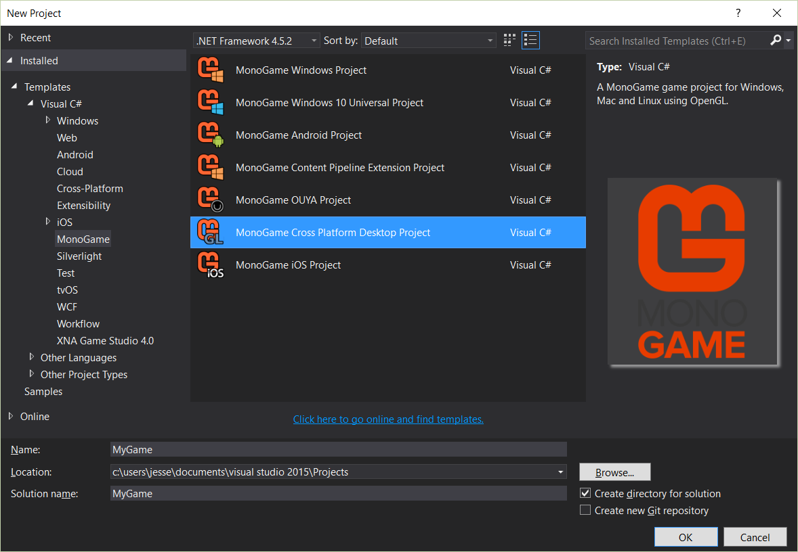
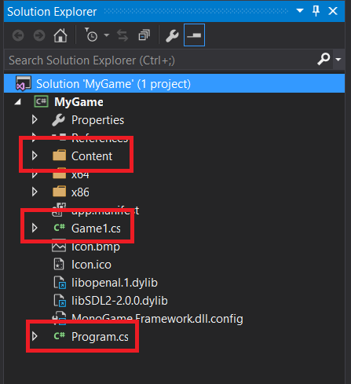

This guide assumes you have installed the MonoGame SDK. If you have not, check out 
[Setting Up MonoGame](setting_up_monogame.md) first. 

## Creating a project

Open up the IDE you installed MonoGame for and create a new project. Select the MonoGame Cross Platform Desktop template.

Hit ok to generate the project.

## Understanding the template

The project will include some dependencies of MonoGame, but you can safely ignore those. The most important files are Game1.cs, 
Program.cs and the Content folder which contains the file Content.mgcb.

Open Program.cs, this is the entry point for your application. All it does is create an instance of Game1 and call Run on it.
The Run method will initialize your game and start a game loop to update and draw your game. Next open Game1.cs. It contains
a class that inherits from Game and some functions overridden from Game. 

The Game1 **constructor** will contain the line `graphics = new GraphicsDeviceManager(this)`. If you don't create a 
GraphicsDeviceManager in the constructor the game will not run. The constructor is the recommended place to change the game 
window settings. Use the [GraphicsDeviceManager](http://www.monogame.net/documentation/?page=T_Microsoft_Xna_Framework_GraphicsDeviceManager) 
instance to set backbuffer size, full screen settings and more. The constructor will also set the RootDirectory of the ContentManager.
The ContentManager is explained in depth in (TODO). 

Next is the **Initialize** function. This will be called after the constructor and should handle any initialization of your game that
does not involve content loading and does not depend on assets.

**LoadContent** will be called after Initialize and should handle loading assets for the game. It should also handle initialization
that depends on assets.

**UnloadContent** is called right before the game exits and should dispose of unmanaged resources that the game uses. Graphical
resources will automatically be disposed by Game and do not need to be explicitly disposed here.

**Update** should handle game logic that should happen every frame. `gameTime.ElapsedGameTime` contains the time that passed since
the last update call. You can use that to make your game speed not dependent on framerate.

Finally the **Draw** function should handle all rendering of the game. It is recommended to not handle game logic in Draw, because
it may be called infrequently. 
