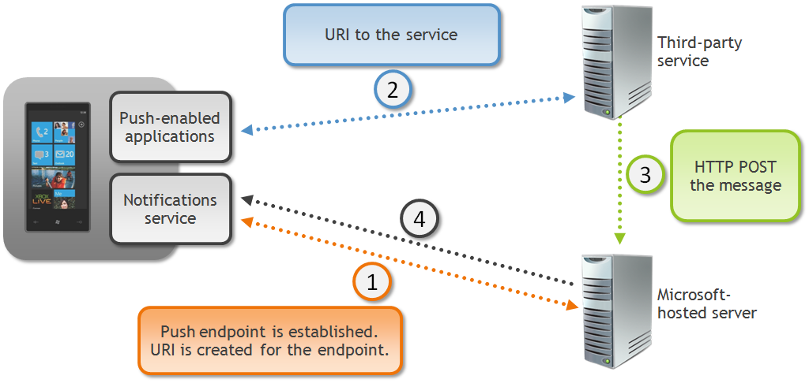

# Push Notifications

# Introduction

Push notifications provide a way for web services to push data to users' devices without waiting for a game to initiate the web request. Push notifications can be sent from any source that can make a web request: a server, a desktop PC, even another Windows Phone.

As with [HttpWebRequest](http://msdn.microsoft.com/en-us/library/system.net.httpwebrequest.aspx), games do not need to use Xbox LIVE to use push notifications.

Note

For more information about initiating web requests on the phone, see [Making Web Requests](WebRequestPhone.md).

# How Push Notifications Work

Push notifications operate in the following way:

1.  While running on the phone, the game creates an **HttpNotificationChannel** object, which provides a unique uniform resource identifier (URI) that uniquely identifies the phone where the game is installed and running.
2.  The game then transmits the URI that identifies the phone to the entity that will initiate push notifications. In most cases, this entity is a web service created by the game developer.
3.  The web service that initiates push notifications sends a specially crafted XML payload to the URI when a notification should be sent to the player's phone. This delivers the notification to the Microsoft Push Notification Service for processing.
4.  The Microsoft Push Notification Service detects when the user's phone has connectivity and sends pending notifications to the device. To optimize available bandwith, these notifications might be sent in batches to the phone by the service.

The following diagram depicts this process:

# Types of Push Notifications

There are three types of push notifications on Windows Phone: toast notifications, tile notifications, and raw notifications. Each of these types is described here.

## Toast Notifications

Toast notifications are short, text-based messages that appear to let a user know about transient data. They consist of two strings of text, and appear at the top of the phone's display.

Clicking a toast notification launches the associated application. While a game is running in the foreground, toast messages received on its notification channel bypass the system pop-up user interface and are routed directly to the game.

## Tile Notifications

Tile notifications can modify the appearance of game and application tiles that a phone user has pinned to the Quick Launch area of their device. Tile notifications can specify a title, a count value, and a background image that can be either a local or remote resource. Tiles in the Quick Launch area respond to notifications regardless of whether the game is running or not. Games cannot intercept tile notifications.

## Raw Notifications

Raw notifications are similar to tile and toast notifications, except they do not have a particular display style or predefined payload format. The data contained in a raw notification is determined by the sender, and the game running on the phone must understand the content. Because the underlying operating system does not handle raw notifications, the game for which the notification is designed must be running in order to handle this type of notification. If the game is not running, the notification is ignored by the phone.

# Unauthenticated and Authenticated Mode

Push notifications can operate in unauthenticated or authenticated mode. In unauthenticated mode, the number and frequency of notifications allowed through the Microsoft Push Notification Service is throttled (unauthenticated push notifications are currently limited to 500 per day, per channel).

For push notifications in authenticated mode, developers first must register a certificate with the Push Notification Service through Windows Phone Marketplace. The certificate must be issued by a Microsoft-trusted root certificate authority. This certificate then is used to establish a Secure Sockets Layer (SSL) connection between the web service and the Push Notification Service. Authenticated push notifications are not throttled.

This section describes how to implement push notifications for your XNA Game Studio game. For more general and detailed information about push notifications on Windows Phone, see [Push Notifications for Windows Phone](http://msdn.microsoft.com/library/ff402537.aspx), on MSDN.

# In This Section

[Setting up Push Notifications](PushNotifications_SettingUp.md)

Describes how to set up a game to use push notifications.

[Responding to Push Notifications on the Client](PushNotifications_Client.md)

Describes how to respond to push notifications received by a running game on Windows Phone.

[Pushing Notifications from a Server](PushNotifications_Server.md)

Describes how to push a toast, tile, or raw notification to a client phone from a server.

# See Also

[Making Web Requests](WebRequestPhone.md)  

© 2012 Microsoft Corporation. All rights reserved.  

© The MonoGame Team