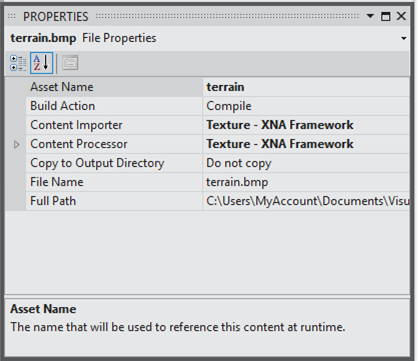



# Game Asset Properties

Describes property settings, indicating which actions the project system should perform on a game asset file of a supported type. For example, you can set file properties to indicate the importer and processor to be used for the game asset file.

Note

When adding a game asset of a type not recognized by XNA Game Studio, you need to modify the **Content Processor** and **Content Importer** properties (by specifying a custom processor and custom importer that build assets of this type) before the asset is built by the Content Pipeline.

### To examine the properties of a game asset

*   In **Solution Explorer**, right-click the file, and then select **Properties** on the context menu. The Properties window appears.
    

In addition to the [standard properties](http://msdn.microsoft.com/en-us/library/0c6xyb66.aspx), XNA Game Studio content files have additional custom properties: **Asset Name**, **Content Importer**, and **Content Processor**.

# Asset Name

The name of the managed object generated by the Content Pipeline from the game asset. At run time, this name is used to load the managed asset by using the [ContentManager.Load](M_Microsoft_Xna_Framework_Content_ContentManager_Load``1.md) method. The default name is the original file name without the file extension.

# Content Importer

The name of the importer for the related game asset. The list contains both custom importers referenced by the content project and standard importers provided by XNA Game Studio.

# Content Processor

The name of the processor for the related game asset. The list contains both custom processors referenced by the content project and standard processors provided by XNA Game Studio. Processors that have modifiable parameters are indicated with a small plus sign next to the Content Processor row. Clicking this expands the Content Processor row to display any supported parameters. Modify these paramter values as you would other properties in this pane. For more information about parameterized processors, see [Parameterized Content Processors](CP_StdParamProcs.md).

# See Also

[What Is Content?](CP_Overview.md)  
[Adding a Custom Importer](CP_AddCustomProcImp.md)  
[Getting Started with XNA Game Studio Development](Getting_Started.md)  

© 2012 Microsoft Corporation. All rights reserved.  
Version: 2.0.61024.0