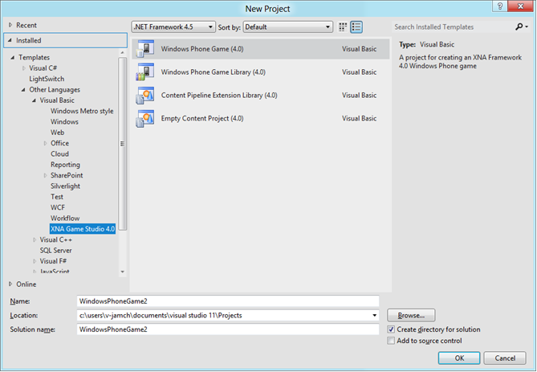
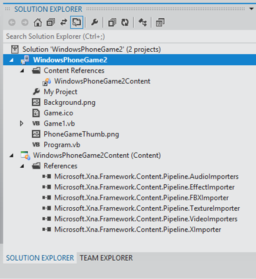
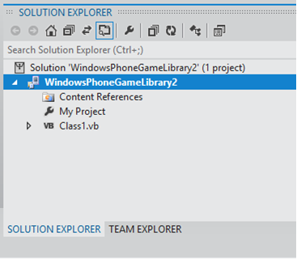

# Creating a Visual Basic Windows Phone Game or Library Project

This topic describes how to use the Visual Basic project templates that are included with XNA Game Studio to begin developing games for Windows Phone using the XNA Framework.

Note

The Windows Phone project templates for Windows Phone SDK 8.0 Extensions for XNA Game Studio 4.0 are available only after the Microsoft Windows Phone SDK has been installed.

Note

In Windows Phone SDK 8.0 Extensions for XNA Game Studio 4.0, you can only build games targeting Windows Phone 7.5, although due to backwards compatability support on Windows Phone, your game will also run on Windows Phone 8.0.

*   [Starting a New Visual Basic Project](#ID4ETE)
*   [Windows Phone Game (4.0)](#ID4E6AAC)
*   [Windows Phone Game Library (4.0)](#ID4EEMAC)

# Starting a New Visual Basic Project

### To start a new Visual Basic project

1.  To begin a new Visual Basic project, click **File**, and then click **New Project**.
    
    If you installed Visual Studio with settings other than Visual Basic Development Settings, you can find the **Visual Basic** node beneath **Other Languages** in the template hierarchy.
    
    You’ll be presented with the **New Project** dialog box, listing several VB project templates.
    

XNA Game Studio provides template types for XNA Framework game development in the Windows Phone SDK 8.0 Extensions for XNA Game Studio 4.0 section of the Visual Basic project types. The templates offered for developing XNA Framework games for Windows Phone are:

Project type

Description

Windows Phone Game (4.0)

A project for creating an game application for Windows Phone.

Windows Phone Game Library (4.0)

A project for creating an game library for Windows Phone.

Content Pipeline Extension Library (4.0)

A project for creating an Content Pipeline Extension Library.

# Windows Phone Game (4.0)

XNA Game Studio provides a Windows Phone Game (4.0) template that creates and loads a set of starter files. This new project contains basic code that renders a colored background.

### To create a Windows Phone Game (4.0) project

1.  On the **File** menu, click **New Project**.
    
2.  Select the **Windows Phone Game (4.0)** project type.
    
3.  Type the name for the game project in the **Name** text box.
    
    You can also modify the default values for the **Location** and **Solution Name** controls In the example below, the project names and the solution name are both (or are based on) "WindowsPhoneGame2".
    
4.  Click **OK** to create and load the new project.
    

## Results

After creating a new Windows Phone game, your solution in Microsoft Visual Studio 2012 will look like the following:

In this case, your Windows Phone game solution actually contains two projects, each with their own distinct features, as described in the following table.

Solution Explorer Item

Description

Project: WindowsPhoneGame2

This project contains the items that constitute the source code and image representation portion of your Windows Phone game. Note that the project name might be different based on the string in the **Name** text box in the **New Project** dialog box.

    Content References

The Content References node references the second project that is automatically added to your Windows Phone game solution. This second project is a game content project named, in this case, "WindowsPhoneGame2Content", and which is used to contain the assets used by your Windows Phone game. For more information about game content projects, see [Game Content Project](UsingXNA_GameContentProjects.md).

    My Project

The My Project node provides access to various properties that control many aspects of your current project. Some examples include general application settings, debug settings, and additional project resources. Double-clicking the My Project node opens the Project Designer for Visual Basic, where you can modify the values for these properties.

The References page of the Project Designer shows the standard assemblies that are automatically added to your new Visual Basic project. These include references to several XNA assemblies and system assemblies.

You can add references to other assemblies as required by your project. For more information about the References Page of the Visual Basic Project Designer, see [References Page, Project Designer (Visual Basic)](http://msdn.microsoft.com/library/t4ttw1f9(v=VS.80).aspx).

    Background.png

The image file Background.png is the image that is displayed when your game is pinned to the Start screen of a Windows Phone. Optimally, this image is 62 × 62 pixels in size (to avoid scaling) and should graphically represent your game.

    Game.ico

The icon file Game.ico is not used by Windows Phone games and should be ignored. This file is included in your project in case you decide to port your game to Xbox 360 and Windows in the future.

    Game1.vb

The VB source file Game1.vb is a good starting point for adding simple game logic and basic features. It implements a single class derived from [Game](T_Microsoft_Xna_Framework_Game.md) and called `Game1`, and it overrides five methods: [LoadContent](M_MXF_Game_LoadContent.md), [UnloadContent](M_MXF_Game_UnloadContent.md), [Initialize](M_Microsoft_Xna_Framework_Game_Initialize.md), [Draw](M_Microsoft_Xna_Framework_Game_Draw.md), and [Update](M_Microsoft_Xna_Framework_Game_Update.md). In addition, the `Game1` constructor is defined. Use these methods to initialize your game components, to load and render your game content, and to handle any input from the user or changes to the game environment.

    PhoneGameThumb.png

The image file PhoneGameThumb.png is the default icon shown when the game is displayed in the Games Hub of a Windows Phone. Optimally, this image is 173 × 173 pixels in size (to avoid scaling) and should graphically represent your game.

    Program.vb

The VB source file Program.vb implements a single class (called `Program`) that provides an entry point to game execution. Usually, little code is added to this file unless the game is fairly advanced.

Project: WindowsPhoneGame2Content (Content)

This game content project occupies a parallel position with the game project in the solution, and it stores and builds art assets for your Windows Phone game. For more information, see [Game Content Project](UsingXNA_GameContentProjects.md).

Note that the project name might be different based on the string in the **Name** text box in the **New Project** dialog box.

    References

The References node provides references to the default Content Importer assemblies provided with Windows Phone SDK 8.0 Extensions for XNA Game Studio 4.0. If you create one or more custom Content Importers, you would add references to their assemblies here.

# Windows Phone Game Library (4.0)

Windows Phone SDK 8.0 Extensions for XNA Game Studio 4.0 provides a Windows Phone Game Library (4.0) template that creates and loads a set of starter files. Typically, projects of this type contain managed classes that implement basic or advanced features used by a game engine. Once completed, these class libraries can be referenced by other Windows Phone projects. Also, they provide common functionality without having that code reside within the game project.

The new project contains basic code that implements an empty library, usable by other Windows Phone Game projects or Windows Phone Game libraries.

### To create a Windows Phone Game Library (4.0) project

1.  On the **File** menu, click **New Project**.
    
2.  Select the **Windows Phone Game Library (4.0)** project type.
    
3.  Type the name for the library project in the **Name** text box.
    
    You can also modify the default values for the **Location** and **Solution Name** controls. In the example below, the project name and the solution name are both "WindowsPhoneGameLibrary2".
    
4.  Click **OK** to create and load the new project.
    

## Results

After creating a new Windows Phone game library, your solution in Microsoft Visual Studio 2012 will look like the following:

In this case, your Windows Phone game library solution contains a single project, with its own distinct features, as described in the following table.

Solution Explorer Item

Description

Project: WindowsPhoneGameLibrary2

This project contains the items that constitute the source code portion of your Windows Phone game library. Note that the project name might be different based on the string in the **Name** text box in the **New Project** dialog box.

    Content References

The Content References node is initially empty. If you add a Content Project to the solution to hold content assets, you should add a reference to the Content Project here. This is useful for including reusable content assets that support the classes and methods in the game library. For more information about game content projects, see [Game Content Project](UsingXNA_GameContentProjects.md).

    My Project

The My Project node provides access to various properties that control many aspects of your current project. Some examples include general application settings, debug settings, and additional project resources. Double-clicking the My Project node opens the Project Designer for Visual Basic, where you can modify the values for these properties.

The References page of the Project Designer shows the standard assemblies that are automatically added to your new Visual Basic project. These include references to several XNA assemblies and system assemblies.

You can add references to other assemblies as required by your project. For more information about the References Page of the Visual Basic Project Designer, see [References Page, Project Designer (Visual Basic)](http://msdn.microsoft.com/library/t4ttw1f9(v=VS.80).aspx)

    Class1.vb

This VB source file Class1.vb begins as an empty VB class within a namespace. It provides a starting point for adding functionality to your Windows Phone game library.

# See Also

[Getting Started with XNA Game Studio Development](Getting_Started.md)  
[Sharing Your Windows Phone Game with Others](XNA_SharingYourGame.md)  
  

© 2012 Microsoft Corporation. All rights reserved.  

© The MonoGame Team